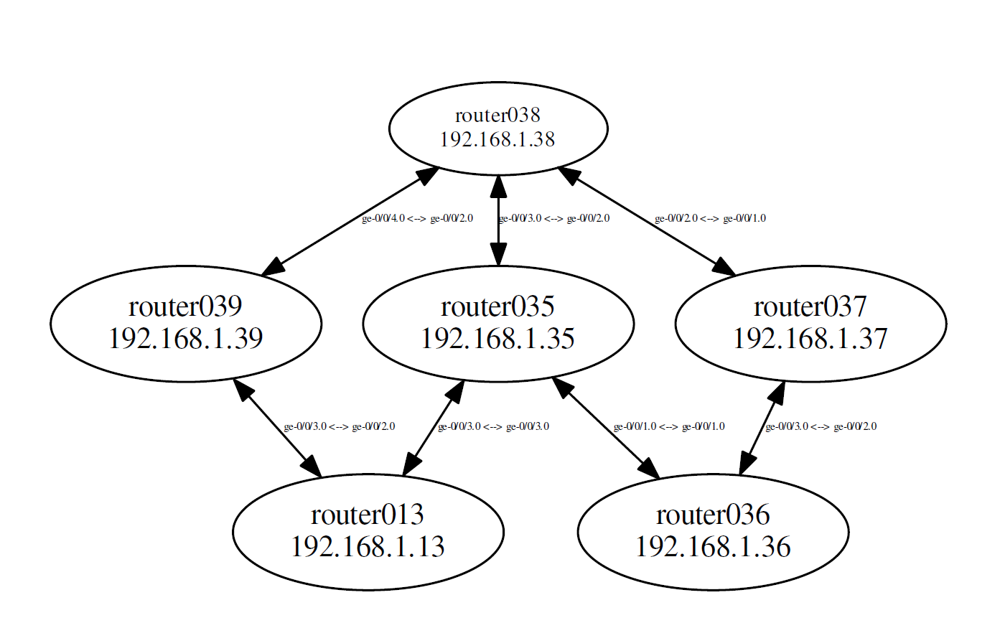

🛰️ Network Topology Visualizer
A Python-based application that automates Junos router configuration, gathers LLDP neighbor data, and visualizes the physical network topology using Graphviz.

📌 Features
🔧 Automated Configuration
Uses Jinja2 templates and PyEZ to configure IP addresses, enable LLDP, and log into Junos routers sequentially.

📡 LLDP-Based Topology Discovery
Collects LLDP neighbor information from Junos devices to map physical connectivity between routers.

🖼️ Graphical Network Visualization
Generates a visual topology graph with Graphviz, displaying:

Routers as nodes

Links as edges

Interface names and IP addresses as labels

🛠️ Tech Stack
Python 3

Junos PyEZ

Jinja2

Graphviz

CentOS VM (Linux environment)

Output example for a 6 node graph - 

